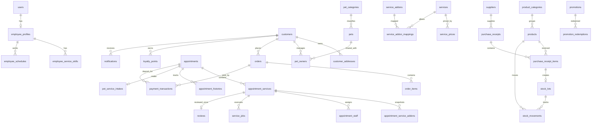

# Thiết Kế Cơ Sở Dữ Liệu

## 1. Mô hình dữ liệu logic chung

- Room/SQLite là CSDL chính của đồ án Android.
- MySQL chỉ là hướng mở rộng theo kiến trúc `Android App -> REST API Backend -> MySQL`.
- Không mô tả Android kết nối trực tiếp tới MySQL.
- Tên bảng và cột dùng tiếng Anh không dấu, `snake_case`.
- Toàn bộ tiền dùng `INTEGER` theo đơn vị đồng Việt Nam.
- Toàn bộ datetime dùng `TEXT` theo ISO-8601 UTC, dạng `yyyy-MM-ddTHH:mm:ssZ`.
- Các field thời gian làm việc tách `work_date`, `start_time`, `end_time`.
- Trọng lượng thú cưng và khoảng cân nặng dùng `INTEGER` theo gram.
- Thiết kế theo DB-first, không thêm màn hình hoặc chức năng nếu không có dữ liệu và nghiệp vụ hỗ trợ từ CSDL.

### 1.1 Tổng số bảng

Tổng số bảng logic: **36**

1. `users`
2. `employee_profiles`
3. `employee_service_skills`
4. `employee_schedules`
5. `customers`
6. `customer_addresses`
7. `activity_logs`
8. `pet_categories`
9. `pets`
10. `pet_owners`
11. `services`
12. `service_prices`
13. `service_addons`
14. `service_addon_mappings`
15. `appointments`
16. `appointment_services`
17. `appointment_service_addons`
18. `appointment_staff`
19. `appointment_histories`
20. `pet_service_intakes`
21. `service_jobs`
22. `product_categories`
23. `products`
24. `suppliers`
25. `purchase_receipts`
26. `purchase_receipt_items`
27. `stock_lots`
28. `stock_movements`
29. `orders`
30. `order_items`
31. `payment_transactions`
32. `promotions`
33. `promotion_redemptions`
34. `loyalty_points`
35. `reviews`
36. `notifications`

### 1.2 Phân loại bảng

- Danh mục hoặc đối tượng độc lập:
  `users`, `employee_profiles`, `customers`, `customer_addresses`, `pet_categories`, `pets`, `services`, `service_addons`, `product_categories`, `products`, `suppliers`, `promotions`, `notifications`
- Bảng chi tiết:
  `purchase_receipt_items`, `appointment_services`, `appointment_service_addons`, `order_items`
- Bảng trung gian:
  `pet_owners`, `appointment_staff`, `service_addon_mappings`, `employee_service_skills`
- Bảng lịch sử:
  `appointment_histories`, `activity_logs`, `loyalty_points`, `promotion_redemptions`
- Bảng giao dịch:
  `appointments`, `pet_service_intakes`, `service_jobs`, `purchase_receipts`, `stock_lots`, `stock_movements`, `orders`, `payment_transactions`, `employee_schedules`

### 1.3 Quan hệ master-detail trong CSDL

| Master | Detail | Ghi chú |
|---|---|---|
| `purchase_receipts` | `purchase_receipt_items` | Phiếu nhập và dòng phiếu nhập |
| `appointments` | `appointment_services` | Một lịch có nhiều dịch vụ |
| `appointment_services` | `appointment_service_addons` | Addon snapshot của từng dịch vụ |
| `appointment_services` | `appointment_staff` | Phân công nhân viên theo từng dịch vụ |
| `appointments` | `appointment_histories` | Lịch sử trạng thái lịch |
| `appointment_services` | `service_jobs` | Tiến độ thao tác chăm sóc |
| `orders` | `order_items` | Hóa đơn và dòng hóa đơn |
| `promotions` | `promotion_redemptions` | Lịch sử dùng mã |
| `employee_profiles` | `employee_service_skills` | Kỹ năng theo dịch vụ |
| `employee_profiles` | `employee_schedules` | Lịch làm việc |

### 1.4 Form master-detail dùng để chấm điểm

1. `Purchase Receipt Form`
   Master: `purchase_receipts`
   Detail: `purchase_receipt_items`
2. `Appointment Form`
   Master: `appointments`
   Detail: `appointment_services`, `appointment_service_addons`
3. `POS / Order Form`
   Master: `orders`
   Detail: `order_items`

### 1.5 Thứ tự tạo bảng

1. `users`
2. `employee_profiles`
3. `customers`
4. `customer_addresses`
5. `activity_logs`
6. `pet_categories`
7. `pets`
8. `pet_owners`
9. `services`
10. `service_addons`
11. `service_addon_mappings`
12. `employee_service_skills`
13. `employee_schedules`
14. `service_prices`
15. `appointments`
16. `appointment_services`
17. `appointment_service_addons`
18. `appointment_staff`
19. `appointment_histories`
20. `pet_service_intakes`
21. `service_jobs`
22. `product_categories`
23. `products`
24. `suppliers`
25. `purchase_receipts`
26. `purchase_receipt_items`
27. `stock_lots`
28. `stock_movements`
29. `promotions`
30. `orders`
31. `order_items`
32. `payment_transactions`
33. `promotion_redemptions`
34. `loyalty_points`
35. `reviews`
36. `notifications`

### 1.6 State machine chuẩn hóa

#### `appointments.status`

`pending_confirmation`, `confirmed`, `arrived`, `checked_in`, `in_service`, `ready_for_pickup`, `completed`, `cancelled`, `no_show`

#### `appointment_services.status`

`pending`, `assigned`, `in_progress`, `paused`, `completed`, `cancelled`

#### `appointment_staff.status`

`assigned`, `accepted`, `in_progress`, `completed`, `cancelled`

#### `service_jobs.status`

`queued`, `in_progress`, `quality_check`, `completed`, `cancelled`

#### `orders.order_status`

`draft`, `confirmed`, `completed`, `cancelled`

#### `orders.payment_status`

`unpaid`, `partial`, `paid`, `partially_refunded`, `refunded`

#### `orders.fulfillment_status`

`unfulfilled`, `preparing`, `ready`, `shipping`, `delivered`

#### `payment_transactions.transaction_status`

`pending`, `success`, `failed`, `cancelled`

## 2. ERD chung



## 3. Data Dictionary chung

### 3.1 Bảng ánh xạ kiểu dữ liệu

| Dữ liệu logic | SQLite/Room | MySQL |
| --- | --- | --- |
| ID tự tăng | `INTEGER PRIMARY KEY AUTOINCREMENT` | `BIGINT AUTO_INCREMENT PRIMARY KEY` |
| Tiền VNĐ | `INTEGER` | `BIGINT` hoặc `DECIMAL(15,0)` |
| Boolean | `INTEGER 0/1` | `BOOLEAN` hoặc `TINYINT(1)` |
| Datetime | `TEXT` chuẩn ISO-8601 UTC | `DATETIME` hoặc `TIMESTAMP` |
| JSON | `TEXT` | `JSON` |
| Chuỗi ngắn | `TEXT` | `VARCHAR(n)` |
| Nội dung dài | `TEXT` | `TEXT` hoặc `LONGTEXT` |

### 3.2 Data Dictionary logic

| Bảng | PK | Mô tả chính | Ràng buộc quan trọng |
|---|---|---|---|
| `users` | `user_id` | tài khoản admin/staff | `username` unique, `role`, `status` |
| `employee_profiles` | `employee_id` | hồ sơ nhân viên | `user_id` unique, `employee_code` unique |
| `employee_service_skills` | `employee_service_skill_id` | kỹ năng theo dịch vụ | unique `(employee_id, service_id)` |
| `employee_schedules` | `employee_schedule_id` | lịch làm việc | unique `(employee_id, work_date, start_time, end_time)` |
| `customers` | `customer_id` | tài khoản khách hàng | `phone` unique, `loyalty_tier`, `status` |
| `customer_addresses` | `customer_address_id` | địa chỉ giao hàng | `is_default` boolean |
| `activity_logs` | `activity_log_id` | log append-only | đúng một actor: user nội bộ hoặc customer, `metadata_json` |
| `pet_categories` | `pet_category_id` | loại thú | `name` unique |
| `pets` | `pet_id` | hồ sơ thú cưng | không còn `customer_id`, dùng `weight_grams` |
| `pet_owners` | `pet_owner_id` | quan hệ khách-thú | unique `(pet_id, customer_id)`, partial unique `is_primary = 1` |
| `services` | `service_id` | dịch vụ chăm sóc | `base_duration` phút |
| `service_prices` | `service_price_id` | bảng giá dịch vụ | `size_group` not null, weight theo gram |
| `service_addons` | `addon_id` | dịch vụ bổ sung | `price`, `duration`, `active` |
| `service_addon_mappings` | `service_addon_mapping_id` | addon được phép theo dịch vụ | unique `(service_id, addon_id)` |
| `appointments` | `appointment_id` | lịch hẹn | xác thực quyền qua `pet_owners` |
| `appointment_services` | `appointment_service_id` | dịch vụ trong lịch | snapshot giá, thời lượng |
| `appointment_service_addons` | `appointment_service_addon_id` | addon snapshot | unique `(appointment_service_id, addon_id)` |
| `appointment_staff` | `appointment_staff_id` | phân công nhân viên | unique `(appointment_service_id, employee_id)` |
| `appointment_histories` | `appointment_history_id` | lịch sử trạng thái | ghi mọi thay đổi trạng thái, actor dùng RESTRICT |
| `pet_service_intakes` | `pet_service_intake_id` | tiếp nhận thú | `current_weight_grams`, `consent_accepted` |
| `service_jobs` | `service_job_id` | tiến độ công việc | quality check, started/finished |
| `product_categories` | `product_category_id` | danh mục sản phẩm | `name` unique |
| `products` | `product_id` | sản phẩm | không còn `quantity` |
| `suppliers` | `supplier_id` | nhà cung cấp | `tax_code` unique |
| `purchase_receipts` | `purchase_receipt_id` | phiếu nhập | `receipt_code` unique |
| `purchase_receipt_items` | `purchase_receipt_item_id` | dòng phiếu nhập | có `batch_number`, `expiry_date` |
| `stock_lots` | `stock_lot_id` | lô tồn kho | nối 1-1 với `purchase_receipt_item_id` |
| `stock_movements` | `stock_movement_id` | ledger biến động kho | `quantity_delta` có dấu |
| `orders` | `order_id` | hóa đơn bán | có snapshot địa chỉ giao hàng |
| `order_items` | `order_item_id` | dòng hóa đơn | CHECK theo `item_type` |
| `payment_transactions` | `payment_id` | thanh toán/cọc/hoàn tiền | chỉ thuộc một `order` hoặc một `appointment`, payment gốc dùng RESTRICT |
| `promotions` | `promotion_id` | khuyến mãi | CHECK theo `discount_type` và `applies_to` |
| `promotion_redemptions` | `promotion_redemption_id` | lịch sử dùng mã | nguồn sự thật lượt dùng |
| `loyalty_points` | `loyalty_point_id` | lịch sử điểm | có thể âm khi trừ |
| `reviews` | `review_id` | đánh giá dịch vụ | 1 review cho 1 `appointment_service` |
| `notifications` | `notification_id` | thông báo khách hàng | `is_read`, `reference_type` NOT NULL DEFAULT `none` |

## 4. SQL chính thức dành cho SQLite/Room

```sql
PRAGMA foreign_keys = ON;

CREATE TABLE users (
    user_id INTEGER PRIMARY KEY AUTOINCREMENT,
    username TEXT NOT NULL UNIQUE,
    password_hash TEXT NOT NULL,
    full_name TEXT NOT NULL,
    phone TEXT UNIQUE,
    email TEXT UNIQUE,
    role TEXT NOT NULL CHECK (role IN ('admin', 'staff')),
    status TEXT NOT NULL DEFAULT 'active' CHECK (status IN ('active', 'inactive', 'locked')),
    created_at TEXT NOT NULL DEFAULT (strftime('%Y-%m-%dT%H:%M:%SZ', 'now')),
    updated_at TEXT NOT NULL DEFAULT (strftime('%Y-%m-%dT%H:%M:%SZ', 'now'))
);

CREATE TABLE employee_profiles (
    employee_id INTEGER PRIMARY KEY AUTOINCREMENT,
    user_id INTEGER NOT NULL UNIQUE,
    employee_code TEXT NOT NULL UNIQUE,
    position TEXT NOT NULL,
    skill_description TEXT,
    hire_date TEXT NOT NULL,
    status TEXT NOT NULL DEFAULT 'active' CHECK (status IN ('active', 'inactive')),
    created_at TEXT NOT NULL DEFAULT (strftime('%Y-%m-%dT%H:%M:%SZ', 'now')),
    updated_at TEXT NOT NULL DEFAULT (strftime('%Y-%m-%dT%H:%M:%SZ', 'now')),
    FOREIGN KEY (user_id) REFERENCES users(user_id) ON DELETE RESTRICT ON UPDATE CASCADE
);

CREATE TABLE customers (
    customer_id INTEGER PRIMARY KEY AUTOINCREMENT,
    full_name TEXT NOT NULL,
    phone TEXT NOT NULL UNIQUE,
    email TEXT UNIQUE,
    password_hash TEXT,
    birth_date TEXT,
    gender TEXT CHECK (gender IN ('male', 'female', 'other')),
    loyalty_tier TEXT NOT NULL DEFAULT 'standard' CHECK (loyalty_tier IN ('standard', 'silver', 'gold', 'diamond')),
    status TEXT NOT NULL DEFAULT 'active' CHECK (status IN ('active', 'inactive', 'blocked')),
    created_at TEXT NOT NULL DEFAULT (strftime('%Y-%m-%dT%H:%M:%SZ', 'now')),
    updated_at TEXT NOT NULL DEFAULT (strftime('%Y-%m-%dT%H:%M:%SZ', 'now'))
);

CREATE TABLE customer_addresses (
    customer_address_id INTEGER PRIMARY KEY AUTOINCREMENT,
    customer_id INTEGER NOT NULL,
    recipient_name TEXT NOT NULL,
    recipient_phone TEXT NOT NULL,
    address_line TEXT NOT NULL,
    ward TEXT,
    district TEXT,
    city TEXT NOT NULL,
    is_default INTEGER NOT NULL DEFAULT 0 CHECK (is_default IN (0, 1)),
    created_at TEXT NOT NULL DEFAULT (strftime('%Y-%m-%dT%H:%M:%SZ', 'now')),
    updated_at TEXT NOT NULL DEFAULT (strftime('%Y-%m-%dT%H:%M:%SZ', 'now')),
    FOREIGN KEY (customer_id) REFERENCES customers(customer_id) ON DELETE CASCADE ON UPDATE CASCADE
);

CREATE TABLE activity_logs (
    activity_log_id INTEGER PRIMARY KEY AUTOINCREMENT,
    actor_user_id INTEGER,
    actor_customer_id INTEGER,
    action_code TEXT NOT NULL,
    target_table TEXT,
    target_id INTEGER,
    description TEXT,
    metadata_json TEXT,
    created_at TEXT NOT NULL DEFAULT (strftime('%Y-%m-%dT%H:%M:%SZ', 'now')),
    FOREIGN KEY (actor_user_id) REFERENCES users(user_id) ON DELETE RESTRICT ON UPDATE CASCADE,
    FOREIGN KEY (actor_customer_id) REFERENCES customers(customer_id) ON DELETE RESTRICT ON UPDATE CASCADE,
    CHECK (
        (actor_user_id IS NOT NULL AND actor_customer_id IS NULL)
        OR
        (actor_user_id IS NULL AND actor_customer_id IS NOT NULL)
    )
);

CREATE TABLE pet_categories (
    pet_category_id INTEGER PRIMARY KEY AUTOINCREMENT,
    name TEXT NOT NULL UNIQUE,
    description TEXT,
    active INTEGER NOT NULL DEFAULT 1 CHECK (active IN (0, 1))
);

CREATE TABLE pets (
    pet_id INTEGER PRIMARY KEY AUTOINCREMENT,
    pet_category_id INTEGER NOT NULL,
    name TEXT NOT NULL,
    breed TEXT,
    date_of_birth TEXT,
    gender TEXT CHECK (gender IN ('male', 'female', 'other')),
    weight_grams INTEGER CHECK (weight_grams IS NULL OR weight_grams > 0),
    color TEXT,
    sterilized INTEGER NOT NULL DEFAULT 0 CHECK (sterilized IN (0, 1)),
    microchip_id TEXT UNIQUE,
    avatar TEXT,
    allergy_notes TEXT,
    medical_notes TEXT,
    behavior_notes TEXT,
    care_notes TEXT,
    status TEXT NOT NULL DEFAULT 'active' CHECK (status IN ('active', 'inactive', 'deceased')),
    created_at TEXT NOT NULL DEFAULT (strftime('%Y-%m-%dT%H:%M:%SZ', 'now')),
    updated_at TEXT NOT NULL DEFAULT (strftime('%Y-%m-%dT%H:%M:%SZ', 'now')),
    FOREIGN KEY (pet_category_id) REFERENCES pet_categories(pet_category_id) ON DELETE RESTRICT ON UPDATE CASCADE
);

CREATE TABLE pet_owners (
    pet_owner_id INTEGER PRIMARY KEY AUTOINCREMENT,
    pet_id INTEGER NOT NULL,
    customer_id INTEGER NOT NULL,
    relationship TEXT NOT NULL,
    is_primary INTEGER NOT NULL DEFAULT 0 CHECK (is_primary IN (0, 1)),
    can_book INTEGER NOT NULL DEFAULT 1 CHECK (can_book IN (0, 1)),
    can_view_history INTEGER NOT NULL DEFAULT 1 CHECK (can_view_history IN (0, 1)),
    status TEXT NOT NULL DEFAULT 'active' CHECK (status IN ('active', 'inactive')),
    created_at TEXT NOT NULL DEFAULT (strftime('%Y-%m-%dT%H:%M:%SZ', 'now')),
    updated_at TEXT NOT NULL DEFAULT (strftime('%Y-%m-%dT%H:%M:%SZ', 'now')),
    FOREIGN KEY (pet_id) REFERENCES pets(pet_id) ON DELETE CASCADE ON UPDATE CASCADE,
    FOREIGN KEY (customer_id) REFERENCES customers(customer_id) ON DELETE CASCADE ON UPDATE CASCADE,
    UNIQUE (pet_id, customer_id)
);

CREATE TABLE services (
    service_id INTEGER PRIMARY KEY AUTOINCREMENT,
    name TEXT NOT NULL UNIQUE,
    description TEXT,
    base_duration INTEGER NOT NULL CHECK (base_duration > 0),
    active INTEGER NOT NULL DEFAULT 1 CHECK (active IN (0, 1)),
    created_at TEXT NOT NULL DEFAULT (strftime('%Y-%m-%dT%H:%M:%SZ', 'now')),
    updated_at TEXT NOT NULL DEFAULT (strftime('%Y-%m-%dT%H:%M:%SZ', 'now'))
);

CREATE TABLE service_addons (
    addon_id INTEGER PRIMARY KEY AUTOINCREMENT,
    name TEXT NOT NULL UNIQUE,
    description TEXT,
    price INTEGER NOT NULL CHECK (price >= 0),
    duration INTEGER NOT NULL DEFAULT 0 CHECK (duration >= 0),
    active INTEGER NOT NULL DEFAULT 1 CHECK (active IN (0, 1)),
    created_at TEXT NOT NULL DEFAULT (strftime('%Y-%m-%dT%H:%M:%SZ', 'now')),
    updated_at TEXT NOT NULL DEFAULT (strftime('%Y-%m-%dT%H:%M:%SZ', 'now'))
);

CREATE TABLE service_addon_mappings (
    service_addon_mapping_id INTEGER PRIMARY KEY AUTOINCREMENT,
    service_id INTEGER NOT NULL,
    addon_id INTEGER NOT NULL,
    active INTEGER NOT NULL DEFAULT 1 CHECK (active IN (0, 1)),
    created_at TEXT NOT NULL DEFAULT (strftime('%Y-%m-%dT%H:%M:%SZ', 'now')),
    FOREIGN KEY (service_id) REFERENCES services(service_id) ON DELETE CASCADE ON UPDATE CASCADE,
    FOREIGN KEY (addon_id) REFERENCES service_addons(addon_id) ON DELETE RESTRICT ON UPDATE CASCADE,
    UNIQUE (service_id, addon_id)
);

CREATE TABLE employee_service_skills (
    employee_service_skill_id INTEGER PRIMARY KEY AUTOINCREMENT,
    employee_id INTEGER NOT NULL,
    service_id INTEGER NOT NULL,
    skill_level TEXT NOT NULL CHECK (skill_level IN ('trainee', 'qualified', 'senior')),
    active INTEGER NOT NULL DEFAULT 1 CHECK (active IN (0, 1)),
    created_at TEXT NOT NULL DEFAULT (strftime('%Y-%m-%dT%H:%M:%SZ', 'now')),
    updated_at TEXT NOT NULL DEFAULT (strftime('%Y-%m-%dT%H:%M:%SZ', 'now')),
    FOREIGN KEY (employee_id) REFERENCES employee_profiles(employee_id) ON DELETE CASCADE ON UPDATE CASCADE,
    FOREIGN KEY (service_id) REFERENCES services(service_id) ON DELETE RESTRICT ON UPDATE CASCADE,
    UNIQUE (employee_id, service_id)
);

CREATE TABLE employee_schedules (
    employee_schedule_id INTEGER PRIMARY KEY AUTOINCREMENT,
    employee_id INTEGER NOT NULL,
    work_date TEXT NOT NULL,
    start_time TEXT NOT NULL,
    end_time TEXT NOT NULL,
    status TEXT NOT NULL CHECK (status IN ('working', 'leave', 'unavailable')),
    note TEXT,
    created_at TEXT NOT NULL DEFAULT (strftime('%Y-%m-%dT%H:%M:%SZ', 'now')),
    updated_at TEXT NOT NULL DEFAULT (strftime('%Y-%m-%dT%H:%M:%SZ', 'now')),
    FOREIGN KEY (employee_id) REFERENCES employee_profiles(employee_id) ON DELETE CASCADE ON UPDATE CASCADE,
    CHECK (end_time > start_time),
    UNIQUE (employee_id, work_date, start_time, end_time)
);

CREATE TABLE service_prices (
    service_price_id INTEGER PRIMARY KEY AUTOINCREMENT,
    service_id INTEGER NOT NULL,
    pet_category_id INTEGER NOT NULL,
    size_group TEXT NOT NULL CHECK (size_group IN ('all', 'small', 'medium', 'large')),
    min_weight_grams INTEGER CHECK (min_weight_grams IS NULL OR min_weight_grams > 0),
    max_weight_grams INTEGER CHECK (max_weight_grams IS NULL OR max_weight_grams > 0),
    price INTEGER NOT NULL CHECK (price >= 0),
    estimated_duration INTEGER NOT NULL CHECK (estimated_duration > 0),
    effective_from TEXT NOT NULL,
    effective_to TEXT,
    active INTEGER NOT NULL DEFAULT 1 CHECK (active IN (0, 1)),
    created_at TEXT NOT NULL DEFAULT (strftime('%Y-%m-%dT%H:%M:%SZ', 'now')),
    updated_at TEXT NOT NULL DEFAULT (strftime('%Y-%m-%dT%H:%M:%SZ', 'now')),
    FOREIGN KEY (service_id) REFERENCES services(service_id) ON DELETE RESTRICT ON UPDATE CASCADE,
    FOREIGN KEY (pet_category_id) REFERENCES pet_categories(pet_category_id) ON DELETE RESTRICT ON UPDATE CASCADE,
    CHECK (effective_to IS NULL OR effective_to >= effective_from),
    CHECK (max_weight_grams IS NULL OR min_weight_grams IS NULL OR max_weight_grams >= min_weight_grams),
    UNIQUE (service_id, pet_category_id, size_group, effective_from)
);

CREATE TABLE appointments (
    appointment_id INTEGER PRIMARY KEY AUTOINCREMENT,
    customer_id INTEGER NOT NULL,
    pet_id INTEGER NOT NULL,
    scheduled_start TEXT NOT NULL,
    scheduled_end TEXT NOT NULL,
    estimated_total INTEGER NOT NULL DEFAULT 0 CHECK (estimated_total >= 0),
    deposit_amount INTEGER NOT NULL DEFAULT 0 CHECK (deposit_amount >= 0),
    status TEXT NOT NULL DEFAULT 'pending_confirmation'
        CHECK (status IN ('pending_confirmation', 'confirmed', 'arrived', 'checked_in', 'in_service', 'ready_for_pickup', 'completed', 'cancelled', 'no_show')),
    source TEXT NOT NULL CHECK (source IN ('customer_app', 'staff_walk_in', 'staff_phone')),
    customer_notes TEXT,
    internal_notes TEXT,
    cancellation_reason TEXT,
    cancelled_by TEXT,
    cancelled_at TEXT,
    created_at TEXT NOT NULL DEFAULT (strftime('%Y-%m-%dT%H:%M:%SZ', 'now')),
    updated_at TEXT NOT NULL DEFAULT (strftime('%Y-%m-%dT%H:%M:%SZ', 'now')),
    FOREIGN KEY (customer_id) REFERENCES customers(customer_id) ON DELETE RESTRICT ON UPDATE CASCADE,
    FOREIGN KEY (pet_id) REFERENCES pets(pet_id) ON DELETE RESTRICT ON UPDATE CASCADE,
    CHECK (scheduled_end > scheduled_start)
);

CREATE TABLE appointment_services (
    appointment_service_id INTEGER PRIMARY KEY AUTOINCREMENT,
    appointment_id INTEGER NOT NULL,
    service_id INTEGER NOT NULL,
    service_price_id INTEGER NOT NULL,
    service_name_snapshot TEXT NOT NULL,
    unit_price INTEGER NOT NULL CHECK (unit_price >= 0),
    estimated_duration INTEGER NOT NULL CHECK (estimated_duration > 0),
    actual_start TEXT,
    actual_end TEXT,
    status TEXT NOT NULL DEFAULT 'pending'
        CHECK (status IN ('pending', 'assigned', 'in_progress', 'paused', 'completed', 'cancelled')),
    surcharge INTEGER NOT NULL DEFAULT 0 CHECK (surcharge >= 0),
    staff_notes TEXT,
    created_at TEXT NOT NULL DEFAULT (strftime('%Y-%m-%dT%H:%M:%SZ', 'now')),
    updated_at TEXT NOT NULL DEFAULT (strftime('%Y-%m-%dT%H:%M:%SZ', 'now')),
    FOREIGN KEY (appointment_id) REFERENCES appointments(appointment_id) ON DELETE CASCADE ON UPDATE CASCADE,
    FOREIGN KEY (service_id) REFERENCES services(service_id) ON DELETE RESTRICT ON UPDATE CASCADE,
    FOREIGN KEY (service_price_id) REFERENCES service_prices(service_price_id) ON DELETE RESTRICT ON UPDATE CASCADE,
    CHECK (actual_end IS NULL OR actual_start IS NULL OR actual_end >= actual_start)
);

CREATE TABLE appointment_service_addons (
    appointment_service_addon_id INTEGER PRIMARY KEY AUTOINCREMENT,
    appointment_service_id INTEGER NOT NULL,
    addon_id INTEGER NOT NULL,
    addon_name_snapshot TEXT NOT NULL,
    unit_price INTEGER NOT NULL CHECK (unit_price >= 0),
    quantity INTEGER NOT NULL DEFAULT 1 CHECK (quantity > 0),
    subtotal INTEGER NOT NULL CHECK (subtotal >= 0),
    created_at TEXT NOT NULL DEFAULT (strftime('%Y-%m-%dT%H:%M:%SZ', 'now')),
    FOREIGN KEY (appointment_service_id) REFERENCES appointment_services(appointment_service_id) ON DELETE CASCADE ON UPDATE CASCADE,
    FOREIGN KEY (addon_id) REFERENCES service_addons(addon_id) ON DELETE RESTRICT ON UPDATE CASCADE,
    UNIQUE (appointment_service_id, addon_id)
);

CREATE TABLE appointment_staff (
    appointment_staff_id INTEGER PRIMARY KEY AUTOINCREMENT,
    appointment_service_id INTEGER NOT NULL,
    employee_id INTEGER NOT NULL,
    role TEXT NOT NULL,
    status TEXT NOT NULL DEFAULT 'assigned'
        CHECK (status IN ('assigned', 'accepted', 'in_progress', 'completed', 'cancelled')),
    assigned_at TEXT NOT NULL DEFAULT (strftime('%Y-%m-%dT%H:%M:%SZ', 'now')),
    actual_start TEXT,
    actual_end TEXT,
    FOREIGN KEY (appointment_service_id) REFERENCES appointment_services(appointment_service_id) ON DELETE CASCADE ON UPDATE CASCADE,
    FOREIGN KEY (employee_id) REFERENCES employee_profiles(employee_id) ON DELETE RESTRICT ON UPDATE CASCADE,
    UNIQUE (appointment_service_id, employee_id),
    CHECK (actual_end IS NULL OR actual_start IS NULL OR actual_end >= actual_start)
);

CREATE TABLE appointment_histories (
    appointment_history_id INTEGER PRIMARY KEY AUTOINCREMENT,
    appointment_id INTEGER NOT NULL,
    changed_by_type TEXT NOT NULL CHECK (changed_by_type IN ('user', 'customer', 'system')),
    old_status TEXT,
    new_status TEXT NOT NULL
        CHECK (new_status IN ('pending_confirmation', 'confirmed', 'arrived', 'checked_in', 'in_service', 'ready_for_pickup', 'completed', 'cancelled', 'no_show')),
    changed_by_user_id INTEGER,
    changed_by_customer_id INTEGER,
    reason TEXT,
    created_at TEXT NOT NULL DEFAULT (strftime('%Y-%m-%dT%H:%M:%SZ', 'now')),
    FOREIGN KEY (appointment_id) REFERENCES appointments(appointment_id) ON DELETE CASCADE ON UPDATE CASCADE,
    FOREIGN KEY (changed_by_user_id) REFERENCES users(user_id) ON DELETE RESTRICT ON UPDATE CASCADE,
    FOREIGN KEY (changed_by_customer_id) REFERENCES customers(customer_id) ON DELETE RESTRICT ON UPDATE CASCADE,
    CHECK (
        (changed_by_type = 'user' AND changed_by_user_id IS NOT NULL AND changed_by_customer_id IS NULL)
        OR
        (changed_by_type = 'customer' AND changed_by_user_id IS NULL AND changed_by_customer_id IS NOT NULL)
        OR
        (changed_by_type = 'system' AND changed_by_user_id IS NULL AND changed_by_customer_id IS NULL)
    )
);

CREATE TABLE pet_service_intakes (
    pet_service_intake_id INTEGER PRIMARY KEY AUTOINCREMENT,
    appointment_id INTEGER NOT NULL UNIQUE,
    pet_id INTEGER NOT NULL,
    received_by_employee_id INTEGER NOT NULL,
    received_at TEXT NOT NULL,
    current_weight_grams INTEGER CHECK (current_weight_grams IS NULL OR current_weight_grams > 0),
    skin_condition TEXT,
    coat_condition TEXT,
    ear_condition TEXT,
    nail_condition TEXT,
    behavior_condition TEXT,
    allergy_confirmation TEXT,
    belongings TEXT,
    customer_request TEXT,
    before_photo TEXT,
    consent_accepted INTEGER NOT NULL DEFAULT 0 CHECK (consent_accepted IN (0, 1)),
    consent_at TEXT,
    notes TEXT,
    FOREIGN KEY (appointment_id) REFERENCES appointments(appointment_id) ON DELETE CASCADE ON UPDATE CASCADE,
    FOREIGN KEY (pet_id) REFERENCES pets(pet_id) ON DELETE RESTRICT ON UPDATE CASCADE,
    FOREIGN KEY (received_by_employee_id) REFERENCES employee_profiles(employee_id) ON DELETE RESTRICT ON UPDATE CASCADE
);

CREATE TABLE service_jobs (
    service_job_id INTEGER PRIMARY KEY AUTOINCREMENT,
    appointment_service_id INTEGER NOT NULL,
    assigned_employee_id INTEGER,
    quality_checked_by INTEGER,
    job_name TEXT NOT NULL,
    status TEXT NOT NULL DEFAULT 'queued'
        CHECK (status IN ('queued', 'in_progress', 'quality_check', 'completed', 'cancelled')),
    started_at TEXT,
    finished_at TEXT,
    notes TEXT,
    created_at TEXT NOT NULL DEFAULT (strftime('%Y-%m-%dT%H:%M:%SZ', 'now')),
    updated_at TEXT NOT NULL DEFAULT (strftime('%Y-%m-%dT%H:%M:%SZ', 'now')),
    FOREIGN KEY (appointment_service_id) REFERENCES appointment_services(appointment_service_id) ON DELETE CASCADE ON UPDATE CASCADE,
    FOREIGN KEY (assigned_employee_id) REFERENCES employee_profiles(employee_id) ON DELETE SET NULL ON UPDATE CASCADE,
    FOREIGN KEY (quality_checked_by) REFERENCES employee_profiles(employee_id) ON DELETE SET NULL ON UPDATE CASCADE
);

CREATE TABLE product_categories (
    product_category_id INTEGER PRIMARY KEY AUTOINCREMENT,
    name TEXT NOT NULL UNIQUE,
    description TEXT,
    active INTEGER NOT NULL DEFAULT 1 CHECK (active IN (0, 1))
);

CREATE TABLE products (
    product_id INTEGER PRIMARY KEY AUTOINCREMENT,
    product_category_id INTEGER NOT NULL,
    name TEXT NOT NULL,
    sku TEXT NOT NULL UNIQUE,
    barcode TEXT UNIQUE,
    selling_price INTEGER NOT NULL CHECK (selling_price >= 0),
    unit TEXT NOT NULL,
    min_stock_level INTEGER NOT NULL DEFAULT 0 CHECK (min_stock_level >= 0),
    description TEXT,
    image TEXT,
    active INTEGER NOT NULL DEFAULT 1 CHECK (active IN (0, 1)),
    created_at TEXT NOT NULL DEFAULT (strftime('%Y-%m-%dT%H:%M:%SZ', 'now')),
    updated_at TEXT NOT NULL DEFAULT (strftime('%Y-%m-%dT%H:%M:%SZ', 'now')),
    FOREIGN KEY (product_category_id) REFERENCES product_categories(product_category_id) ON DELETE RESTRICT ON UPDATE CASCADE
);

CREATE TABLE suppliers (
    supplier_id INTEGER PRIMARY KEY AUTOINCREMENT,
    name TEXT NOT NULL UNIQUE,
    phone TEXT,
    email TEXT,
    tax_code TEXT UNIQUE,
    address TEXT,
    status TEXT NOT NULL DEFAULT 'active' CHECK (status IN ('active', 'inactive')),
    created_at TEXT NOT NULL DEFAULT (strftime('%Y-%m-%dT%H:%M:%SZ', 'now')),
    updated_at TEXT NOT NULL DEFAULT (strftime('%Y-%m-%dT%H:%M:%SZ', 'now'))
);

CREATE TABLE purchase_receipts (
    purchase_receipt_id INTEGER PRIMARY KEY AUTOINCREMENT,
    supplier_id INTEGER NOT NULL,
    received_by_user_id INTEGER NOT NULL,
    receipt_code TEXT NOT NULL UNIQUE,
    receipt_date TEXT NOT NULL,
    total_amount INTEGER NOT NULL DEFAULT 0 CHECK (total_amount >= 0),
    note TEXT,
    status TEXT NOT NULL DEFAULT 'draft' CHECK (status IN ('draft', 'confirmed', 'cancelled')),
    created_at TEXT NOT NULL DEFAULT (strftime('%Y-%m-%dT%H:%M:%SZ', 'now')),
    updated_at TEXT NOT NULL DEFAULT (strftime('%Y-%m-%dT%H:%M:%SZ', 'now')),
    FOREIGN KEY (supplier_id) REFERENCES suppliers(supplier_id) ON DELETE RESTRICT ON UPDATE CASCADE,
    FOREIGN KEY (received_by_user_id) REFERENCES users(user_id) ON DELETE RESTRICT ON UPDATE CASCADE
);

CREATE TABLE purchase_receipt_items (
    purchase_receipt_item_id INTEGER PRIMARY KEY AUTOINCREMENT,
    purchase_receipt_id INTEGER NOT NULL,
    product_id INTEGER NOT NULL,
    batch_number TEXT NOT NULL,
    expiry_date TEXT,
    quantity INTEGER NOT NULL CHECK (quantity > 0),
    unit_cost INTEGER NOT NULL CHECK (unit_cost >= 0),
    subtotal INTEGER NOT NULL CHECK (subtotal >= 0),
    note TEXT,
    FOREIGN KEY (purchase_receipt_id) REFERENCES purchase_receipts(purchase_receipt_id) ON DELETE RESTRICT ON UPDATE CASCADE,
    FOREIGN KEY (product_id) REFERENCES products(product_id) ON DELETE RESTRICT ON UPDATE CASCADE,
    UNIQUE (purchase_receipt_id, product_id, batch_number)
);

CREATE TABLE stock_lots (
    stock_lot_id INTEGER PRIMARY KEY AUTOINCREMENT,
    purchase_receipt_item_id INTEGER NOT NULL UNIQUE,
    product_id INTEGER NOT NULL,
    supplier_id INTEGER,
    batch_number TEXT NOT NULL,
    expiry_date TEXT,
    received_quantity INTEGER NOT NULL CHECK (received_quantity > 0),
    remaining_quantity INTEGER NOT NULL CHECK (remaining_quantity >= 0 AND remaining_quantity <= received_quantity),
    unit_cost INTEGER NOT NULL CHECK (unit_cost >= 0),
    received_at TEXT NOT NULL,
    status TEXT NOT NULL DEFAULT 'active' CHECK (status IN ('active', 'inactive', 'expired')),
    FOREIGN KEY (purchase_receipt_item_id) REFERENCES purchase_receipt_items(purchase_receipt_item_id) ON DELETE RESTRICT ON UPDATE CASCADE,
    FOREIGN KEY (product_id) REFERENCES products(product_id) ON DELETE RESTRICT ON UPDATE CASCADE,
    FOREIGN KEY (supplier_id) REFERENCES suppliers(supplier_id) ON DELETE SET NULL ON UPDATE CASCADE,
    UNIQUE (product_id, batch_number)
);

CREATE TABLE stock_movements (
    stock_movement_id INTEGER PRIMARY KEY AUTOINCREMENT,
    product_id INTEGER NOT NULL,
    stock_lot_id INTEGER,
    movement_type TEXT NOT NULL
        CHECK (movement_type IN ('purchase_receipt', 'sale', 'order_cancel', 'customer_return', 'damaged', 'expired', 'inventory_adjustment')),
    quantity_delta INTEGER NOT NULL CHECK (quantity_delta != 0),
    reference_type TEXT,
    reference_id INTEGER,
    reason TEXT,
    unit_cost INTEGER,
    created_by_user_id INTEGER,
    created_at TEXT NOT NULL DEFAULT (strftime('%Y-%m-%dT%H:%M:%SZ', 'now')),
    FOREIGN KEY (product_id) REFERENCES products(product_id) ON DELETE RESTRICT ON UPDATE CASCADE,
    FOREIGN KEY (stock_lot_id) REFERENCES stock_lots(stock_lot_id) ON DELETE SET NULL ON UPDATE CASCADE,
    FOREIGN KEY (created_by_user_id) REFERENCES users(user_id) ON DELETE SET NULL ON UPDATE CASCADE
);

CREATE TABLE promotions (
    promotion_id INTEGER PRIMARY KEY AUTOINCREMENT,
    code TEXT NOT NULL UNIQUE,
    name TEXT NOT NULL,
    discount_type TEXT NOT NULL CHECK (discount_type IN ('percent', 'fixed_amount')),
    discount_value INTEGER NOT NULL,
    min_order_value INTEGER NOT NULL DEFAULT 0 CHECK (min_order_value >= 0),
    max_discount_value INTEGER CHECK (max_discount_value IS NULL OR max_discount_value >= 0),
    usage_limit INTEGER CHECK (usage_limit IS NULL OR usage_limit > 0),
    usage_limit_per_customer INTEGER CHECK (usage_limit_per_customer IS NULL OR usage_limit_per_customer > 0),
    applies_to TEXT NOT NULL CHECK (applies_to IN ('order', 'product', 'service')),
    target_product_category_id INTEGER,
    target_service_id INTEGER,
    start_at TEXT NOT NULL,
    end_at TEXT NOT NULL,
    status TEXT NOT NULL CHECK (status IN ('active', 'inactive', 'expired')),
    created_at TEXT NOT NULL DEFAULT (strftime('%Y-%m-%dT%H:%M:%SZ', 'now')),
    updated_at TEXT NOT NULL DEFAULT (strftime('%Y-%m-%dT%H:%M:%SZ', 'now')),
    FOREIGN KEY (target_product_category_id) REFERENCES product_categories(product_category_id) ON DELETE SET NULL ON UPDATE CASCADE,
    FOREIGN KEY (target_service_id) REFERENCES services(service_id) ON DELETE SET NULL ON UPDATE CASCADE,
    CHECK (end_at >= start_at),
    CHECK (
        (discount_type = 'percent' AND discount_value BETWEEN 1 AND 100) OR
        (discount_type = 'fixed_amount' AND discount_value > 0)
    ),
    CHECK (
        (applies_to = 'order' AND target_product_category_id IS NULL AND target_service_id IS NULL) OR
        (applies_to = 'product' AND target_product_category_id IS NOT NULL AND target_service_id IS NULL) OR
        (applies_to = 'service' AND target_product_category_id IS NULL AND target_service_id IS NOT NULL)
    )
);

CREATE TABLE orders (
    order_id INTEGER PRIMARY KEY AUTOINCREMENT,
    customer_id INTEGER,
    customer_address_id INTEGER,
    created_by_user_id INTEGER,
    source TEXT NOT NULL CHECK (source IN ('pos', 'customer_app')),
    order_status TEXT NOT NULL DEFAULT 'draft' CHECK (order_status IN ('draft', 'confirmed', 'completed', 'cancelled')),
    payment_status TEXT NOT NULL DEFAULT 'unpaid' CHECK (payment_status IN ('unpaid', 'partial', 'paid', 'partially_refunded', 'refunded')),
    fulfillment_status TEXT NOT NULL DEFAULT 'unfulfilled' CHECK (fulfillment_status IN ('unfulfilled', 'preparing', 'ready', 'shipping', 'delivered')),
    subtotal INTEGER NOT NULL DEFAULT 0 CHECK (subtotal >= 0),
    discount_amount INTEGER NOT NULL DEFAULT 0 CHECK (discount_amount >= 0),
    loyalty_discount INTEGER NOT NULL DEFAULT 0 CHECK (loyalty_discount >= 0),
    shipping_fee INTEGER NOT NULL DEFAULT 0 CHECK (shipping_fee >= 0),
    total_amount INTEGER NOT NULL DEFAULT 0 CHECK (total_amount >= 0),
    shipping_recipient_name TEXT,
    shipping_phone TEXT,
    shipping_address_snapshot TEXT,
    shipping_note TEXT,
    notes TEXT,
    created_at TEXT NOT NULL DEFAULT (strftime('%Y-%m-%dT%H:%M:%SZ', 'now')),
    completed_at TEXT,
    cancelled_at TEXT,
    FOREIGN KEY (customer_id) REFERENCES customers(customer_id) ON DELETE SET NULL ON UPDATE CASCADE,
    FOREIGN KEY (customer_address_id) REFERENCES customer_addresses(customer_address_id) ON DELETE SET NULL ON UPDATE CASCADE,
    FOREIGN KEY (created_by_user_id) REFERENCES users(user_id) ON DELETE SET NULL ON UPDATE CASCADE
);

CREATE TABLE order_items (
    order_item_id INTEGER PRIMARY KEY AUTOINCREMENT,
    order_id INTEGER NOT NULL,
    item_type TEXT NOT NULL CHECK (item_type IN ('product', 'service', 'surcharge', 'deposit_deduction')),
    product_id INTEGER,
    appointment_service_id INTEGER,
    description_snapshot TEXT NOT NULL,
    quantity INTEGER NOT NULL CHECK (quantity > 0),
    unit_price INTEGER NOT NULL CHECK (unit_price >= 0),
    discount_amount INTEGER NOT NULL DEFAULT 0 CHECK (discount_amount >= 0),
    subtotal INTEGER NOT NULL CHECK (subtotal >= 0),
    FOREIGN KEY (order_id) REFERENCES orders(order_id) ON DELETE CASCADE ON UPDATE CASCADE,
    FOREIGN KEY (product_id) REFERENCES products(product_id) ON DELETE SET NULL ON UPDATE CASCADE,
    FOREIGN KEY (appointment_service_id) REFERENCES appointment_services(appointment_service_id) ON DELETE SET NULL ON UPDATE CASCADE,
    CHECK (discount_amount <= quantity * unit_price),
    CHECK (
        (item_type = 'product' AND product_id IS NOT NULL AND appointment_service_id IS NULL) OR
        (item_type = 'service' AND product_id IS NULL AND appointment_service_id IS NOT NULL) OR
        (item_type IN ('surcharge', 'deposit_deduction') AND product_id IS NULL AND appointment_service_id IS NULL)
    )
);

CREATE TABLE payment_transactions (
    payment_id INTEGER PRIMARY KEY AUTOINCREMENT,
    order_id INTEGER,
    appointment_id INTEGER,
    transaction_type TEXT NOT NULL CHECK (transaction_type IN ('payment', 'refund', 'void')),
    amount INTEGER NOT NULL CHECK (amount > 0),
    payment_method TEXT NOT NULL,
    payment_purpose TEXT NOT NULL,
    transaction_status TEXT NOT NULL DEFAULT 'pending' CHECK (transaction_status IN ('pending', 'success', 'failed', 'cancelled')),
    transaction_code TEXT UNIQUE,
    original_payment_id INTEGER,
    refund_reason TEXT,
    created_by_user_id INTEGER,
    processed_at TEXT,
    created_at TEXT NOT NULL DEFAULT (strftime('%Y-%m-%dT%H:%M:%SZ', 'now')),
    FOREIGN KEY (order_id) REFERENCES orders(order_id) ON DELETE SET NULL ON UPDATE CASCADE,
    FOREIGN KEY (appointment_id) REFERENCES appointments(appointment_id) ON DELETE SET NULL ON UPDATE CASCADE,
    FOREIGN KEY (original_payment_id) REFERENCES payment_transactions(payment_id) ON DELETE RESTRICT ON UPDATE CASCADE,
    FOREIGN KEY (created_by_user_id) REFERENCES users(user_id) ON DELETE SET NULL ON UPDATE CASCADE,
    CHECK (
        (order_id IS NOT NULL AND appointment_id IS NULL) OR
        (order_id IS NULL AND appointment_id IS NOT NULL)
    ),
    CHECK (
        (transaction_type = 'payment' AND original_payment_id IS NULL)
        OR
        (transaction_type IN ('refund', 'void') AND original_payment_id IS NOT NULL)
    )
);

CREATE TABLE promotion_redemptions (
    promotion_redemption_id INTEGER PRIMARY KEY AUTOINCREMENT,
    promotion_id INTEGER NOT NULL,
    order_id INTEGER NOT NULL,
    customer_id INTEGER,
    discount_amount INTEGER NOT NULL CHECK (discount_amount >= 0),
    redeemed_at TEXT NOT NULL DEFAULT (strftime('%Y-%m-%dT%H:%M:%SZ', 'now')),
    FOREIGN KEY (promotion_id) REFERENCES promotions(promotion_id) ON DELETE RESTRICT ON UPDATE CASCADE,
    FOREIGN KEY (order_id) REFERENCES orders(order_id) ON DELETE CASCADE ON UPDATE CASCADE,
    FOREIGN KEY (customer_id) REFERENCES customers(customer_id) ON DELETE SET NULL ON UPDATE CASCADE,
    UNIQUE (promotion_id, order_id)
);

CREATE TABLE loyalty_points (
    loyalty_point_id INTEGER PRIMARY KEY AUTOINCREMENT,
    customer_id INTEGER NOT NULL,
    point_amount INTEGER NOT NULL,
    transaction_type TEXT NOT NULL CHECK (transaction_type IN ('earn', 'redeem', 'adjust', 'refund_reversal')),
    reference_type TEXT NOT NULL CHECK (reference_type IN ('order', 'payment', 'appointment', 'manual')),
    reference_id INTEGER NOT NULL,
    status TEXT NOT NULL CHECK (status IN ('active', 'used', 'expired', 'reversed')),
    expires_at TEXT,
    description TEXT,
    created_at TEXT NOT NULL DEFAULT (strftime('%Y-%m-%dT%H:%M:%SZ', 'now')),
    FOREIGN KEY (customer_id) REFERENCES customers(customer_id) ON DELETE CASCADE ON UPDATE CASCADE
);

CREATE TABLE reviews (
    review_id INTEGER PRIMARY KEY AUTOINCREMENT,
    appointment_service_id INTEGER NOT NULL UNIQUE,
    customer_id INTEGER NOT NULL,
    rating INTEGER NOT NULL CHECK (rating BETWEEN 1 AND 5),
    comment TEXT,
    status TEXT NOT NULL CHECK (status IN ('visible', 'hidden')),
    created_at TEXT NOT NULL DEFAULT (strftime('%Y-%m-%dT%H:%M:%SZ', 'now')),
    FOREIGN KEY (appointment_service_id) REFERENCES appointment_services(appointment_service_id) ON DELETE RESTRICT ON UPDATE CASCADE,
    FOREIGN KEY (customer_id) REFERENCES customers(customer_id) ON DELETE RESTRICT ON UPDATE CASCADE
);

CREATE TABLE notifications (
    notification_id INTEGER PRIMARY KEY AUTOINCREMENT,
    customer_id INTEGER NOT NULL,
    title TEXT NOT NULL,
    content TEXT NOT NULL,
    type TEXT NOT NULL CHECK (type IN ('appointment', 'order', 'promotion', 'system')),
    reference_type TEXT NOT NULL DEFAULT 'none' CHECK (reference_type IN ('appointment', 'order', 'promotion', 'none')),
    reference_id INTEGER,
    is_read INTEGER NOT NULL DEFAULT 0 CHECK (is_read IN (0, 1)),
    sent_at TEXT NOT NULL DEFAULT (strftime('%Y-%m-%dT%H:%M:%SZ', 'now')),
    read_at TEXT,
    FOREIGN KEY (customer_id) REFERENCES customers(customer_id) ON DELETE CASCADE ON UPDATE CASCADE,
    CHECK (
        (reference_type = 'none' AND reference_id IS NULL)
        OR
        (reference_type IN ('appointment', 'order', 'promotion') AND reference_id IS NOT NULL)
    )
);

CREATE UNIQUE INDEX idx_pet_owners_one_primary
ON pet_owners(pet_id)
WHERE is_primary = 1;

CREATE INDEX idx_activity_logs_created_at ON activity_logs(created_at);
CREATE INDEX idx_employee_service_skills_lookup ON employee_service_skills(employee_id, service_id, active);
CREATE INDEX idx_employee_schedules_lookup ON employee_schedules(employee_id, work_date, status);
CREATE INDEX idx_service_prices_lookup ON service_prices(service_id, pet_category_id, size_group, active);
CREATE INDEX idx_service_addon_mappings_service ON service_addon_mappings(service_id, active);
CREATE INDEX idx_appointments_pet_schedule_status ON appointments(pet_id, scheduled_start, scheduled_end, status);
CREATE INDEX idx_appointments_customer_schedule ON appointments(customer_id, scheduled_start);
CREATE INDEX idx_appointment_services_appointment_status ON appointment_services(appointment_id, status);
CREATE INDEX idx_appointment_staff_employee_status ON appointment_staff(employee_id, status);
CREATE INDEX idx_service_jobs_service_status ON service_jobs(appointment_service_id, status);
CREATE INDEX idx_products_sku ON products(sku);
CREATE INDEX idx_products_barcode ON products(barcode);
CREATE INDEX idx_purchase_receipts_receipt_date ON purchase_receipts(receipt_date);
CREATE INDEX idx_stock_lots_product_expiry ON stock_lots(product_id, expiry_date, status);
CREATE INDEX idx_stock_movements_product_created ON stock_movements(product_id, created_at);
CREATE INDEX idx_orders_customer_id ON orders(customer_id);
CREATE INDEX idx_orders_created_at ON orders(created_at);
CREATE INDEX idx_payment_transactions_order_id ON payment_transactions(order_id);
CREATE INDEX idx_payment_transactions_appointment_id ON payment_transactions(appointment_id);
CREATE INDEX idx_loyalty_points_customer_created ON loyalty_points(customer_id, created_at);
CREATE INDEX idx_notifications_customer_read ON notifications(customer_id, is_read, sent_at);
```

### 4.1 Danh sách khóa ngoại

| Bảng | Cột | Tham chiếu | ON DELETE | ON UPDATE |
|---|---|---|---|---|
| `employee_profiles` | `user_id` | `users(user_id)` | RESTRICT | CASCADE |
| `employee_service_skills` | `employee_id` | `employee_profiles(employee_id)` | CASCADE | CASCADE |
| `employee_service_skills` | `service_id` | `services(service_id)` | RESTRICT | CASCADE |
| `employee_schedules` | `employee_id` | `employee_profiles(employee_id)` | CASCADE | CASCADE |
| `customer_addresses` | `customer_id` | `customers(customer_id)` | CASCADE | CASCADE |
| `activity_logs` | `actor_user_id` | `users(user_id)` | RESTRICT | CASCADE |
| `activity_logs` | `actor_customer_id` | `customers(customer_id)` | RESTRICT | CASCADE |
| `pets` | `pet_category_id` | `pet_categories(pet_category_id)` | RESTRICT | CASCADE |
| `pet_owners` | `pet_id` | `pets(pet_id)` | CASCADE | CASCADE |
| `pet_owners` | `customer_id` | `customers(customer_id)` | CASCADE | CASCADE |
| `service_addon_mappings` | `service_id` | `services(service_id)` | CASCADE | CASCADE |
| `service_addon_mappings` | `addon_id` | `service_addons(addon_id)` | RESTRICT | CASCADE |
| `service_prices` | `service_id` | `services(service_id)` | RESTRICT | CASCADE |
| `service_prices` | `pet_category_id` | `pet_categories(pet_category_id)` | RESTRICT | CASCADE |
| `appointments` | `customer_id` | `customers(customer_id)` | RESTRICT | CASCADE |
| `appointments` | `pet_id` | `pets(pet_id)` | RESTRICT | CASCADE |
| `appointment_services` | `appointment_id` | `appointments(appointment_id)` | CASCADE | CASCADE |
| `appointment_services` | `service_id` | `services(service_id)` | RESTRICT | CASCADE |
| `appointment_services` | `service_price_id` | `service_prices(service_price_id)` | RESTRICT | CASCADE |
| `appointment_service_addons` | `appointment_service_id` | `appointment_services(appointment_service_id)` | CASCADE | CASCADE |
| `appointment_service_addons` | `addon_id` | `service_addons(addon_id)` | RESTRICT | CASCADE |
| `appointment_staff` | `appointment_service_id` | `appointment_services(appointment_service_id)` | CASCADE | CASCADE |
| `appointment_staff` | `employee_id` | `employee_profiles(employee_id)` | RESTRICT | CASCADE |
| `appointment_histories` | `appointment_id` | `appointments(appointment_id)` | CASCADE | CASCADE |
| `appointment_histories` | `changed_by_user_id` | `users(user_id)` | RESTRICT | CASCADE |
| `appointment_histories` | `changed_by_customer_id` | `customers(customer_id)` | RESTRICT | CASCADE |
| `pet_service_intakes` | `appointment_id` | `appointments(appointment_id)` | CASCADE | CASCADE |
| `pet_service_intakes` | `pet_id` | `pets(pet_id)` | RESTRICT | CASCADE |
| `pet_service_intakes` | `received_by_employee_id` | `employee_profiles(employee_id)` | RESTRICT | CASCADE |
| `service_jobs` | `appointment_service_id` | `appointment_services(appointment_service_id)` | CASCADE | CASCADE |
| `service_jobs` | `assigned_employee_id` | `employee_profiles(employee_id)` | SET NULL | CASCADE |
| `service_jobs` | `quality_checked_by` | `employee_profiles(employee_id)` | SET NULL | CASCADE |
| `products` | `product_category_id` | `product_categories(product_category_id)` | RESTRICT | CASCADE |
| `purchase_receipts` | `supplier_id` | `suppliers(supplier_id)` | RESTRICT | CASCADE |
| `purchase_receipts` | `received_by_user_id` | `users(user_id)` | RESTRICT | CASCADE |
| `purchase_receipt_items` | `purchase_receipt_id` | `purchase_receipts(purchase_receipt_id)` | RESTRICT | CASCADE |
| `purchase_receipt_items` | `product_id` | `products(product_id)` | RESTRICT | CASCADE |
| `stock_lots` | `purchase_receipt_item_id` | `purchase_receipt_items(purchase_receipt_item_id)` | RESTRICT | CASCADE |
| `stock_lots` | `product_id` | `products(product_id)` | RESTRICT | CASCADE |
| `stock_lots` | `supplier_id` | `suppliers(supplier_id)` | SET NULL | CASCADE |
| `stock_movements` | `product_id` | `products(product_id)` | RESTRICT | CASCADE |
| `stock_movements` | `stock_lot_id` | `stock_lots(stock_lot_id)` | SET NULL | CASCADE |
| `stock_movements` | `created_by_user_id` | `users(user_id)` | SET NULL | CASCADE |
| `promotions` | `target_product_category_id` | `product_categories(product_category_id)` | SET NULL | CASCADE |
| `promotions` | `target_service_id` | `services(service_id)` | SET NULL | CASCADE |
| `orders` | `customer_id` | `customers(customer_id)` | SET NULL | CASCADE |
| `orders` | `customer_address_id` | `customer_addresses(customer_address_id)` | SET NULL | CASCADE |
| `orders` | `created_by_user_id` | `users(user_id)` | SET NULL | CASCADE |
| `order_items` | `order_id` | `orders(order_id)` | CASCADE | CASCADE |
| `order_items` | `product_id` | `products(product_id)` | SET NULL | CASCADE |
| `order_items` | `appointment_service_id` | `appointment_services(appointment_service_id)` | SET NULL | CASCADE |
| `payment_transactions` | `order_id` | `orders(order_id)` | SET NULL | CASCADE |
| `payment_transactions` | `appointment_id` | `appointments(appointment_id)` | SET NULL | CASCADE |
| `payment_transactions` | `original_payment_id` | `payment_transactions(payment_id)` | RESTRICT | CASCADE |
| `payment_transactions` | `created_by_user_id` | `users(user_id)` | SET NULL | CASCADE |
| `promotion_redemptions` | `promotion_id` | `promotions(promotion_id)` | RESTRICT | CASCADE |
| `promotion_redemptions` | `order_id` | `orders(order_id)` | CASCADE | CASCADE |
| `promotion_redemptions` | `customer_id` | `customers(customer_id)` | SET NULL | CASCADE |
| `loyalty_points` | `customer_id` | `customers(customer_id)` | CASCADE | CASCADE |
| `reviews` | `appointment_service_id` | `appointment_services(appointment_service_id)` | RESTRICT | CASCADE |
| `reviews` | `customer_id` | `customers(customer_id)` | RESTRICT | CASCADE |
| `notifications` | `customer_id` | `customers(customer_id)` | CASCADE | CASCADE |

### 4.2 Quy tắc transaction và validation ở tầng UseCase/Repository

- `pet_owners` là nguồn sở hữu duy nhất; khi tạo lịch phải kiểm tra `can_book = 1`, `status = 'active'`.
- Không cho hai `service_prices` active chồng thời gian cho cùng `service_id`, `pet_category_id`, `size_group`.
- Khi gán nhân viên phải kiểm tra:
  `employee_profiles.status = active`,
  có `employee_service_skills`,
  có `employee_schedules.status = working`,
  không giao ca với `appointment_staff`.
- `stock_lots.remaining_quantity` là nguồn sự thật tồn kho; không cập nhật tồn trực tiếp trong `products`.
- `payment_transactions` refund phải tham chiếu payment gốc, cùng đối tượng, và tổng refund success không vượt payment gốc.
- `activity_logs` là append-only; DAO chỉ có insert và query.

### 4.3 Action code quan trọng cho ActivityLog

- `pos_order_created`
- `purchase_receipt_confirmed`
- `appointment_created`
- `appointment_rescheduled`
- `appointment_cancelled`
- `appointment_no_show`
- `pet_intake_completed`
- `staff_assigned`
- `service_job_updated`
- `final_billing_completed`
- `refund_created`
- `promotion_applied`

## 5. Phụ lục ánh xạ từ SQLite sang MySQL

### 5.1 Quy tắc kiến trúc

- `Android App -> REST API Backend -> MySQL`
- `Room` chỉ là dữ liệu cục bộ hoặc cache offline
- Không trộn SQL SQLite và MySQL trong cùng một câu lệnh

### 5.2 Ánh xạ SQLite -> MySQL

| Chủ đề | SQLite/Room | MySQL mở rộng |
|---|---|---|
| Auto increment | `INTEGER PRIMARY KEY AUTOINCREMENT` | `BIGINT AUTO_INCREMENT PRIMARY KEY` |
| Boolean | `INTEGER 0/1` | `BOOLEAN` hoặc `TINYINT(1)` |
| Datetime | `TEXT` ISO-8601 UTC | `DATETIME` hoặc `TIMESTAMP` UTC |
| JSON | `TEXT` | `JSON` |
| Partial unique index | hỗ trợ trong SQLite hiện đại | có thể thay bằng generated column hoặc unique filtered logic ở backend |

### 5.3 Kiểm tra SQL bắt buộc

1. Thứ tự `CREATE TABLE` đã sắp để bảng FK được tạo sau bảng cha.
2. Tổng số `CREATE TABLE`: **36**.
3. Không còn `products.quantity`.
4. Không còn `pets.customer_id`.
5. `stock_lots` có `purchase_receipt_item_id`.
6. `order_items` có `CHECK` theo `item_type`.
7. `payment_transactions` có `CHECK` sở hữu đúng một đối tượng.
8. `service_prices.size_group` là `NOT NULL`.
9. Mọi trường tiền dùng `INTEGER`.
10. Mọi datetime dùng `TEXT` UTC.
11. Các bảng nhiều-nhiều có `UNIQUE` phù hợp.
12. `activity_logs` chỉ được mô tả insert/query, không có update/delete.
