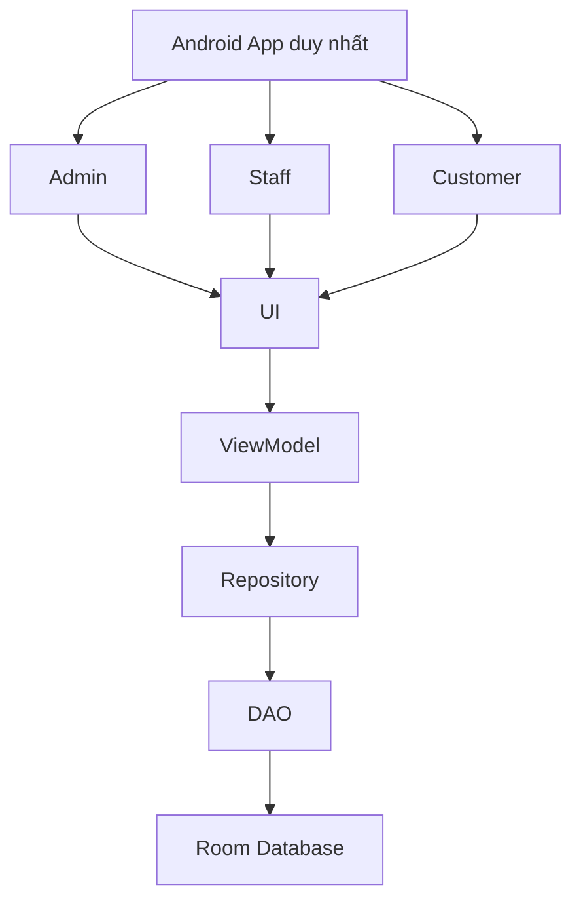

# PetStoreApp Documentation

## 1. Mục tiêu đề tài

PetStoreApp là bộ tài liệu thiết kế cho **một ứng dụng Android duy nhất** phục vụ bán sản phẩm và chăm sóc thú cưng. Repository hiện tại chỉ chứa tài liệu, **chưa có project Android Studio** và **không có mã nguồn Java, XML, Gradle** trong phạm vi nhiệm vụ này.

Phạm vi chính thức:

- Bán sản phẩm dành cho thú cưng
- Quản lý dịch vụ chăm sóc thú cưng
- Quản lý lịch hẹn chăm sóc
- Quản lý hồ sơ khách hàng và thú cưng
- Quản lý kho, nhập hàng và lô tồn
- Quản lý thanh toán, khuyến mãi, điểm thưởng, đánh giá và thông báo
- Quản lý nhân viên phục vụ và phân công dịch vụ
- Báo cáo doanh thu, lịch hẹn, dịch vụ và tồn kho

Không thuộc phạm vi:

- Bán thú cưng sống
- Nhận nuôi hoặc chợ trao đổi thú cưng
- Bảo hành thú cưng
- Hợp đồng mua bán thú cưng
- Quản lý chuồng cho thú cưng chờ bán
- Chẩn đoán bệnh, kê đơn, điều trị thú y chuyên sâu

## 2. Kiến trúc dữ liệu và kỹ thuật

- Thiết kế theo nguyên tắc **DB-first**: từ CSDL suy ra chức năng, không làm ngược lại
- **Room/SQLite** là CSDL chính cho đồ án Android
- **MySQL** chỉ là hướng mở rộng trong tương lai theo mô hình:
  `Android App -> REST API Backend -> MySQL`
- Tên bảng và cột dùng tiếng Anh không dấu, `snake_case`
- Tiền lưu bằng `INTEGER` theo đơn vị đồng Việt Nam
- Datetime chuẩn hóa dạng `TEXT` ISO-8601 UTC

## 3. Cấu trúc dữ liệu chính

Tổng số bảng logic: **36**

- Người dùng và khách hàng:
  `users`, `employee_profiles`, `employee_service_skills`, `employee_schedules`, `customers`, `customer_addresses`, `activity_logs`
- Hồ sơ thú cưng:
  `pet_categories`, `pets`, `pet_owners`
- Dịch vụ và bảng giá:
  `services`, `service_prices`, `service_addons`, `service_addon_mappings`
- Lịch hẹn và thực thi dịch vụ:
  `appointments`, `appointment_services`, `appointment_service_addons`, `appointment_staff`, `appointment_histories`, `pet_service_intakes`, `service_jobs`
- Sản phẩm và tồn kho:
  `product_categories`, `products`, `suppliers`, `purchase_receipts`, `purchase_receipt_items`, `stock_lots`, `stock_movements`
- Bán hàng và thanh toán:
  `orders`, `order_items`, `payment_transactions`
- Khuyến mãi và chăm sóc khách hàng:
  `promotions`, `promotion_redemptions`, `loyalty_points`, `reviews`, `notifications`

## 4. Actor và phạm vi sử dụng

- `Admin`: quản trị người dùng nội bộ, nhân viên, danh mục, báo cáo, nhật ký hệ thống
- `Staff`: nhập kho, bán hàng, xử lý lịch hẹn, tiếp nhận thú, thực hiện chăm sóc, thanh toán
- `Customer`: quản lý hồ sơ cá nhân, thú cưng, đặt lịch, mua hàng, theo dõi đơn, đánh giá

## 5. Sáu quy trình bắt buộc

1. Bán sản phẩm tại quầy
2. Nhập kho
3. Khách hàng đặt lịch chăm sóc
4. Tiếp nhận và thực hiện chăm sóc
5. Thanh toán và bàn giao thú
6. Đổi lịch, hủy lịch và no-show

## 6. Chỉ tiêu tài liệu đã đồng bộ

| Hạng mục | Số lượng |
|---|---:|
| Bảng | 36 |
| Java Entity | 36 |
| DAO | 36 |
| Repository | 18 |
| ViewModel | 25 |
| Chức năng đối tượng | 18 |
| Chức năng quy trình | 6 |
| Màn hình Admin/Staff | 24 |
| Màn hình Customer | 20 |
| Form master-detail | 3 |
| Report chính | 12 |

## 7. Master-detail chính dùng để chấm điểm

1. `Purchase Receipt Form`
   Master: `purchase_receipts`
   Detail: `purchase_receipt_items`
2. `Appointment Form`
   Master: `appointments`
   Detail: `appointment_services`, `appointment_service_addons`
3. `POS / Order Form`
   Master: `orders`
   Detail: `order_items`

## 8. ViewModel theo module

- `AuthViewModel` dùng chung cho đăng nhập `Admin`, `Staff`, `Customer`
- `OrderViewModel` dùng chung cho POS và Checkout
- Customer dùng chung ViewModel theo module, không theo từng màn hình
- `Employee Management` là một màn hình có 3 tab
- `Activity Log` là màn hình riêng cho `Admin`

## 9. State machine tổng quát

- `appointments`:
  `pending_confirmation -> confirmed -> arrived -> checked_in -> in_service -> ready_for_pickup -> completed`
- Nhánh phụ:
  `pending_confirmation -> cancelled`
  `confirmed -> cancelled`
  `confirmed -> no_show`
- `orders`:
  `draft -> confirmed -> completed`
- Nhánh phụ:
  `draft -> cancelled`
  `confirmed -> cancelled`
- `payment_transactions.transaction_status`:
  `pending -> success | failed | cancelled`

## 10. Tài liệu liên quan

- [DATABASE.md](DATABASE.md)
- [CHUC-NANG.md](CHUC-NANG.md)
- [LUONG-THUC-TE.md](LUONG-THUC-TE.md)
- [VD-LUONG-NGUOI-DUNG.md](VD-LUONG-NGUOI-DUNG.md)
- [implementation-notes.md](implementation-notes.md)
- [Use Case Diagram](UML/USE-CASE.md)
- [Activity Diagram](UML/ACTIVITY-DIAGRAM.md)
- [Sequence Diagram](UML/SEQUENCE-DIAGRAM.md)
- [Class Diagram](UML/CLASS-DIAGRAM.md)
