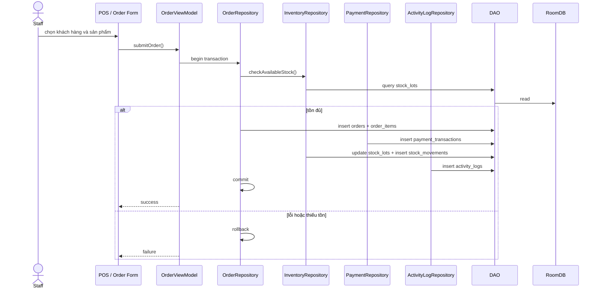
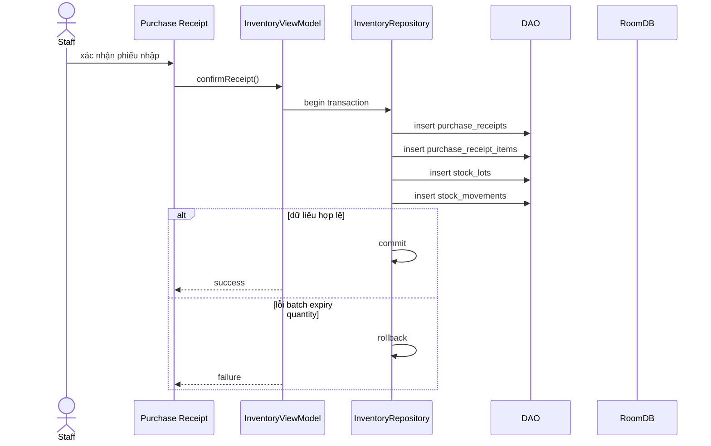
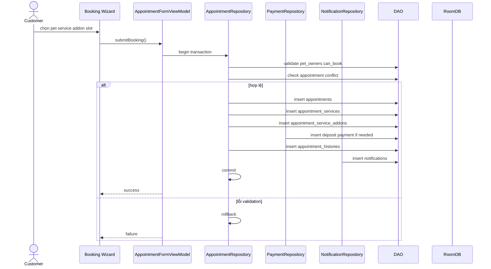
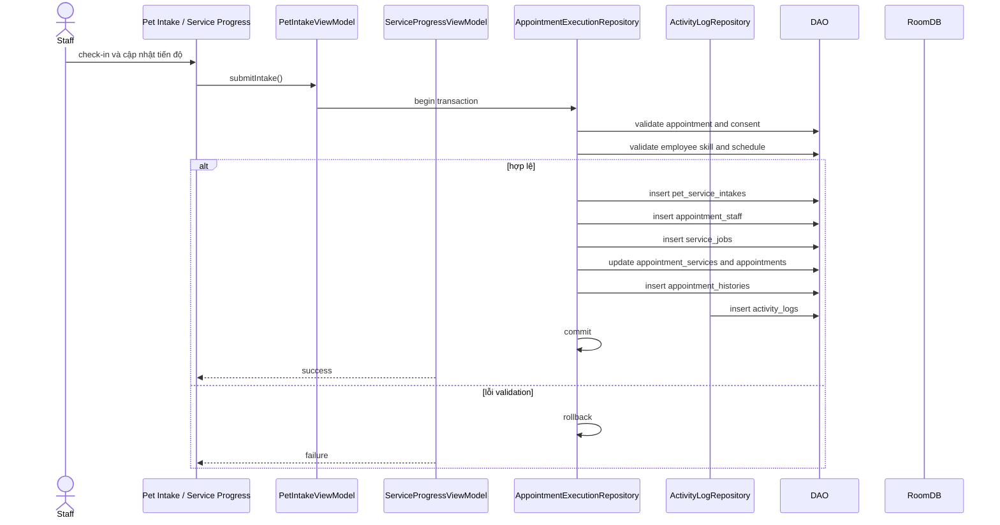
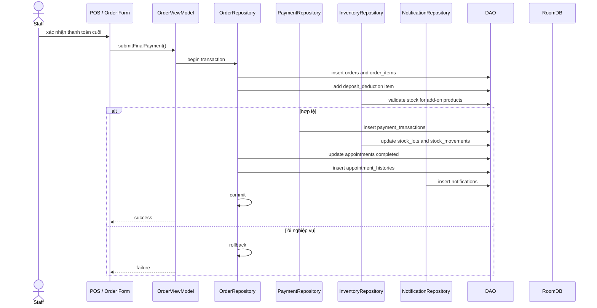
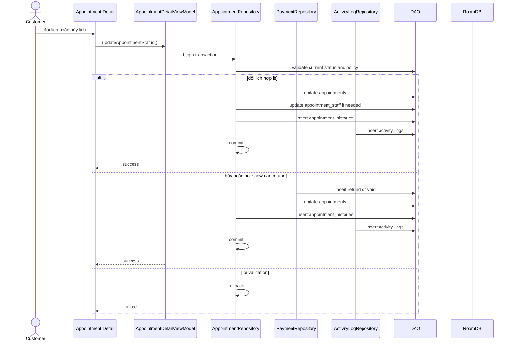

# Sequence Diagram

## 1. Bán sản phẩm tại quầy

## 2. Nhập kho

## 3. Khách hàng đặt lịch chăm sóc

## 4. Tiếp nhận và thực hiện chăm sóc

## 5. Thanh toán và bàn giao thú

## 6. Đổi lịch, hủy lịch và no-show

