# Use Case Diagram

## Tổng quan

Tài liệu này biểu diễn use case bằng `Mermaid flowchart LR` vì Mermaid không có cú pháp use case native.

```mermaid
flowchart LR
    Admin[Admin]
    Staff[Staff]
    Customer[Customer]

    subgraph Internal["Tài khoản và nhân sự"]
        UC1[Đăng nhập]
        UC2[Quản lý tài khoản nội bộ]
        UC3[Quản lý nhân viên]
        UC4[Quản lý kỹ năng nhân viên]
        UC5[Quản lý lịch làm]
    end

    subgraph ProductService["Sản phẩm, dịch vụ và khuyến mãi"]
        UC6[Quản lý sản phẩm]
        UC7[Quản lý danh mục sản phẩm]
        UC8[Quản lý dịch vụ]
        UC9[Quản lý bảng giá và addon]
        UC10[Quản lý khuyến mãi]
        UC11[Xem sản phẩm]
        UC12[Xem dịch vụ]
    end

    subgraph CustomerPet["Khách hàng và thú cưng"]
        UC13[Quản lý khách hàng]
        UC14[Quản lý hồ sơ]
        UC15[Quản lý địa chỉ]
        UC16[Quản lý thú cưng]
    end

    subgraph InventorySales["Kho, bán hàng và thanh toán"]
        UC17[Nhập kho]
        UC18[Tra cứu tồn kho]
        UC19[Bán hàng tại quầy]
        UC20[Thanh toán]
        UC21[Cart / Checkout]
        UC22[Xem lịch sử đơn hàng]
    end

    subgraph AppointmentCare["Lịch hẹn và chăm sóc"]
        UC23[Tạo lịch hẹn]
        UC24[Đặt lịch]
        UC25[Xem lịch sử lịch hẹn]
        UC26[Tiếp nhận thú]
        UC27[Phân công nhân viên]
        UC28[Cập nhật tiến độ dịch vụ]
        UC29[Đổi lịch]
        UC30[Hủy lịch]
        UC31[Xử lý no-show]
    end

    subgraph LoyaltyReview["Điểm thưởng, đánh giá và log"]
        UC32[Xem thông báo]
        UC33[Xem điểm thưởng]
        UC34[Đánh giá dịch vụ]
        UC35[Xem báo cáo]
        UC36[Xem Activity Log]
        UC37[Đăng ký]
        UC38[Quên mật khẩu]
    end

    Admin --> UC1
    Admin --> UC2
    Admin --> UC3
    Admin --> UC4
    Admin --> UC5
    Admin --> UC6
    Admin --> UC7
    Admin --> UC8
    Admin --> UC9
    Admin --> UC10
    Admin --> UC35
    Admin --> UC36

    Staff --> UC1
    Staff --> UC13
    Staff --> UC16
    Staff --> UC17
    Staff --> UC18
    Staff --> UC23
    Staff --> UC26
    Staff --> UC27
    Staff --> UC28
    Staff --> UC19
    Staff --> UC20
    Staff --> UC29
    Staff --> UC30
    Staff --> UC31

    Customer --> UC37
    Customer --> UC1
    Customer --> UC38
    Customer --> UC14
    Customer --> UC15
    Customer --> UC16
    Customer --> UC12
    Customer --> UC24
    Customer --> UC25
    Customer --> UC29
    Customer --> UC30
    Customer --> UC11
    Customer --> UC21
    Customer --> UC22
    Customer --> UC32
    Customer --> UC33
    Customer --> UC34
```

## Ghi chú

- Use Case Diagram được biểu diễn bằng Mermaid flowchart.
- Customer là role trong cùng một Android app.
- MySQL chỉ là hướng mở rộng tương lai.
