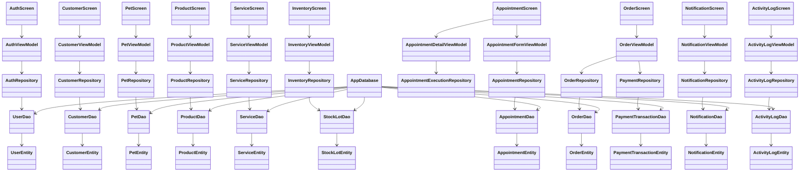
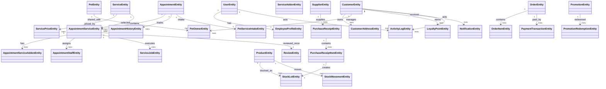

# Class Diagram

## 1. Kiến trúc MVVM

```mermaid
classDiagram
    class AuthScreen
    class CustomerScreen
    class PetScreen
    class ProductScreen
    class ServiceScreen
    class InventoryScreen
    class AppointmentScreen
    class OrderScreen
    class NotificationScreen
    class ActivityLogScreen

    class AuthViewModel
    class CustomerViewModel
    class PetViewModel
    class ProductViewModel
    class ServiceViewModel
    class InventoryViewModel
    class AppointmentFormViewModel
    class AppointmentDetailViewModel
    class OrderViewModel
    class NotificationViewModel
    class ActivityLogViewModel

    class AuthRepository
    class CustomerRepository
    class PetRepository
    class ProductRepository
    class ServiceRepository
    class InventoryRepository
    class AppointmentRepository
    class AppointmentExecutionRepository
    class OrderRepository
    class PaymentRepository
    class NotificationRepository
    class ActivityLogRepository

    class UserDao
    class CustomerDao
    class PetDao
    class ProductDao
    class ServiceDao
    class StockLotDao
    class AppointmentDao
    class OrderDao
    class PaymentTransactionDao
    class NotificationDao
    class ActivityLogDao

    class AppDatabase

    class UserEntity
    class CustomerEntity
    class PetEntity
    class ProductEntity
    class ServiceEntity
    class StockLotEntity
    class AppointmentEntity
    class OrderEntity
    class PaymentTransactionEntity
    class NotificationEntity
    class ActivityLogEntity

    AuthScreen --> AuthViewModel
    CustomerScreen --> CustomerViewModel
    PetScreen --> PetViewModel
    ProductScreen --> ProductViewModel
    ServiceScreen --> ServiceViewModel
    InventoryScreen --> InventoryViewModel
    AppointmentScreen --> AppointmentFormViewModel
    AppointmentScreen --> AppointmentDetailViewModel
    OrderScreen --> OrderViewModel
    NotificationScreen --> NotificationViewModel
    ActivityLogScreen --> ActivityLogViewModel

    AuthViewModel --> AuthRepository
    CustomerViewModel --> CustomerRepository
    PetViewModel --> PetRepository
    ProductViewModel --> ProductRepository
    ServiceViewModel --> ServiceRepository
    InventoryViewModel --> InventoryRepository
    AppointmentFormViewModel --> AppointmentRepository
    AppointmentDetailViewModel --> AppointmentExecutionRepository
    OrderViewModel --> OrderRepository
    OrderViewModel --> PaymentRepository
    NotificationViewModel --> NotificationRepository
    ActivityLogViewModel --> ActivityLogRepository

    AuthRepository --> UserDao
    CustomerRepository --> CustomerDao
    PetRepository --> PetDao
    ProductRepository --> ProductDao
    ServiceRepository --> ServiceDao
    InventoryRepository --> StockLotDao
    AppointmentRepository --> AppointmentDao
    OrderRepository --> OrderDao
    PaymentRepository --> PaymentTransactionDao
    NotificationRepository --> NotificationDao
    ActivityLogRepository --> ActivityLogDao

    UserDao --> UserEntity
    CustomerDao --> CustomerEntity
    PetDao --> PetEntity
    ProductDao --> ProductEntity
    ServiceDao --> ServiceEntity
    StockLotDao --> StockLotEntity
    AppointmentDao --> AppointmentEntity
    OrderDao --> OrderEntity
    PaymentTransactionDao --> PaymentTransactionEntity
    NotificationDao --> NotificationEntity
    ActivityLogDao --> ActivityLogEntity

    AppDatabase --> UserDao
    AppDatabase --> CustomerDao
    AppDatabase --> PetDao
    AppDatabase --> ProductDao
    AppDatabase --> ServiceDao
    AppDatabase --> StockLotDao
    AppDatabase --> AppointmentDao
    AppDatabase --> OrderDao
    AppDatabase --> PaymentTransactionDao
    AppDatabase --> NotificationDao
    AppDatabase --> ActivityLogDao
```

## 2. Domain and Database

```mermaid
classDiagram
    class UserEntity
    class EmployeeProfileEntity
    class CustomerEntity
    class CustomerAddressEntity
    class PetEntity
    class PetOwnerEntity
    class ServiceEntity
    class ServicePriceEntity
    class ServiceAddonEntity
    class AppointmentEntity
    class AppointmentServiceEntity
    class AppointmentServiceAddonEntity
    class AppointmentStaffEntity
    class AppointmentHistoryEntity
    class PetServiceIntakeEntity
    class ServiceJobEntity
    class ProductEntity
    class SupplierEntity
    class PurchaseReceiptEntity
    class PurchaseReceiptItemEntity
    class StockLotEntity
    class StockMovementEntity
    class OrderEntity
    class OrderItemEntity
    class PaymentTransactionEntity
    class PromotionEntity
    class PromotionRedemptionEntity
    class LoyaltyPointEntity
    class ReviewEntity
    class NotificationEntity
    class ActivityLogEntity

    UserEntity "1" --> "1" EmployeeProfileEntity : has
    CustomerEntity "1" --> "many" CustomerAddressEntity : owns
    CustomerEntity "1" --> "many" PetOwnerEntity : manages
    PetEntity "1" --> "many" PetOwnerEntity : shared_with
    ServiceEntity "1" --> "many" ServicePriceEntity : priced_by
    ServiceEntity "1" --> "many" AppointmentServiceEntity : selected
    AppointmentEntity "1" --> "many" AppointmentServiceEntity : contains
    AppointmentServiceEntity "1" --> "many" AppointmentServiceAddonEntity : has
    AppointmentServiceEntity "1" --> "many" AppointmentStaffEntity : assigns
    AppointmentEntity "1" --> "many" AppointmentHistoryEntity : tracks
    AppointmentEntity "1" --> "1" PetServiceIntakeEntity : intake
    AppointmentServiceEntity "1" --> "many" ServiceJobEntity : executes
    SupplierEntity "1" --> "many" PurchaseReceiptEntity : supplies
    PurchaseReceiptEntity "1" --> "many" PurchaseReceiptItemEntity : contains
    PurchaseReceiptItemEntity "1" --> "1" StockLotEntity : creates
    ProductEntity "1" --> "many" StockLotEntity : stocked_as
    ProductEntity "1" --> "many" StockMovementEntity : moves
    OrderEntity "1" --> "many" OrderItemEntity : contains
    OrderEntity "1" --> "many" PaymentTransactionEntity : paid_by
    PromotionEntity "1" --> "many" PromotionRedemptionEntity : redeemed
    CustomerEntity "1" --> "many" LoyaltyPointEntity : earns
    AppointmentServiceEntity "1" --> "1" ReviewEntity : reviewed_once
    CustomerEntity "1" --> "many" NotificationEntity : receives
    UserEntity "1" --> "many" ActivityLogEntity : acts
    CustomerEntity "1" --> "many" ActivityLogEntity : acts
```
